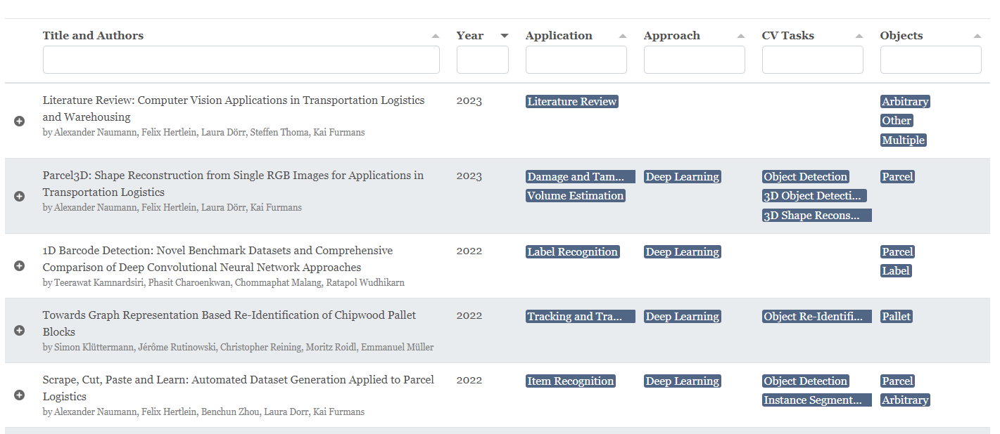

[](https://arxiv.org/abs/2304.06009)

# Literature Review Website

Code for the online literature review website of our paper.



## Usage

Use the `devcontainer` or Docker and build

```
jekyll build --incremental
```

and then serve

```
jekyll serve --livereload --baseurl ""
```

## Credits & License

- [Lanyon](https://github.com/poole/lanyon/) Jekyll Template: [MIT](https://github.com/poole/lanyon/blob/master/LICENSE.md) License
- [Tabulator](https://github.com/olifolkerd/tabulator) for smart table: [MIT](https://github.com/olifolkerd/tabulator/blob/master/LICENSE) license
- [Bootstrap Icons](https://github.com/twbs/icons): [MIT](https://github.com/twbs/icons/blob/main/LICENSE) license
- [Github CSS ribbon](https://github.com/simonwhitaker/github-fork-ribbon-css): [MIT](https://github.com/simonwhitaker/github-fork-ribbon-css/blob/gh-pages/LICENSE) License
- [EasyAutocomplete](https://github.com/pawelczak/EasyAutocomplete) for search: [MIT](https://github.com/pawelczak/EasyAutocomplete/blob/master/LICENSE.txt) license

Unless stated otherwise, this project is licensed under the [MIT](LICENSE) license.
